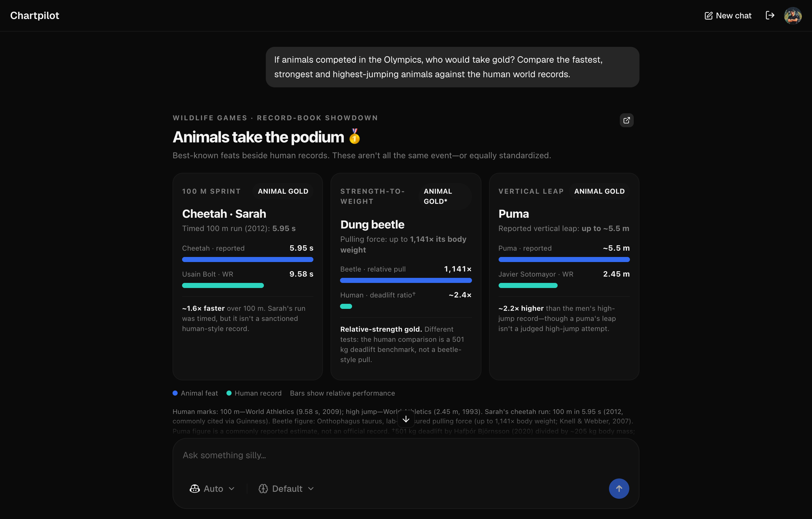
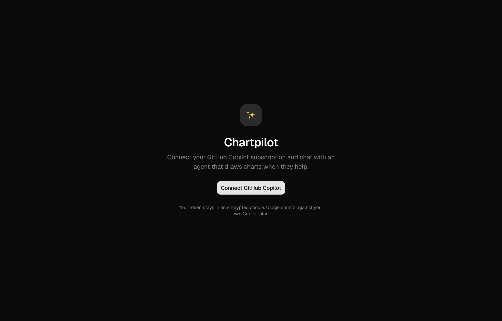
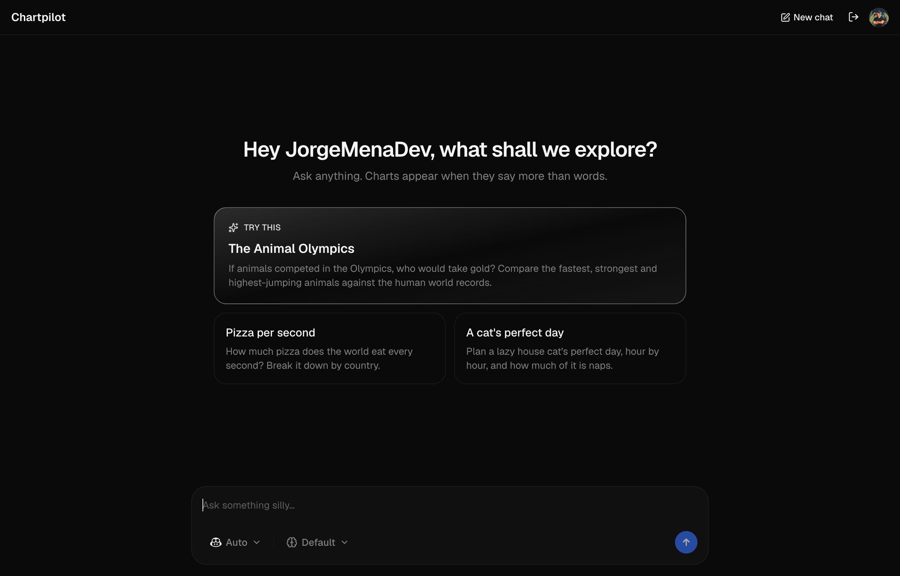
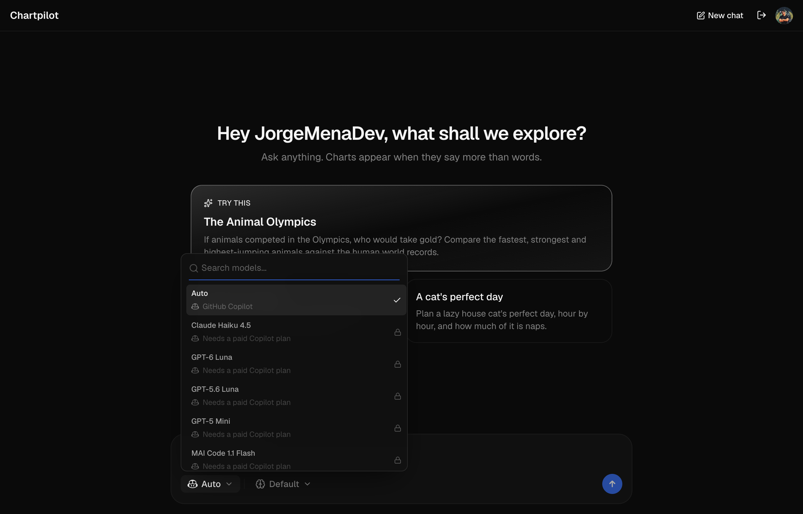
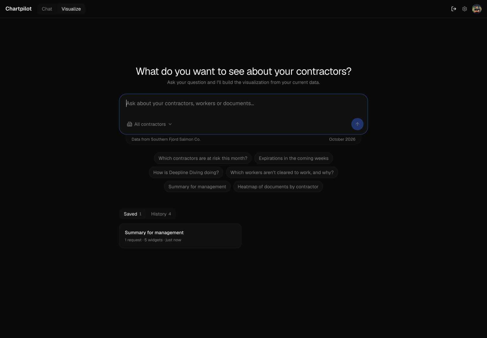
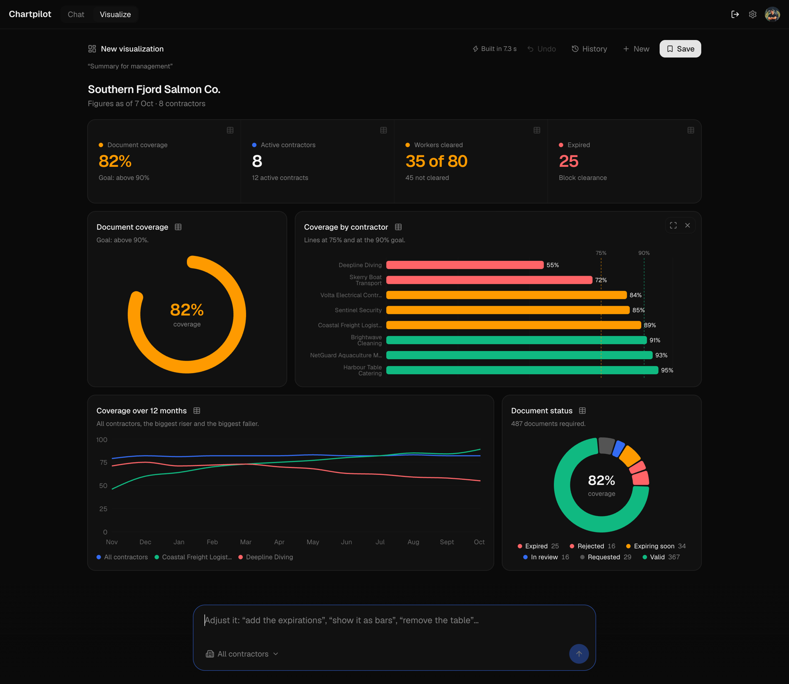

# Chartpilot

**Chat with an agent on your own GitHub Copilot plan. It draws charts when they say more than words, and builds dashboards from your data.**

Sign in with GitHub and pick a tab:

- **Chat:** ask anything, and the agent decides when a visual helps. It writes a self-contained HTML page, previews it in a headless browser, fixes what looks wrong, and publishes it inline above its reply.
- **Visualize:** ask a question about a company's contractors and get a dashboard of live widgets built from its data. Follow-up questions edit the dashboard.



## Features

- **Your own Copilot plan.** Users sign in with GitHub's device flow, the same "enter this code on github.com" flow OpenCode uses. Usage counts against each user's Copilot plan. The app holds no model API keys.
- **Charts without asking.** The agent has two tools, `html_preview` and `html_render`, ported from [T3 Code](https://github.com/pingdotgg/t3code)'s visuals feature. It previews each page as a screenshot before showing it, so it can catch its own layout bugs.
- **Themed, sandboxed visuals.** Pages render in a sandboxed iframe with the app's colours injected as CSS variables (`--chart-1` … `--chart-6` and more). Each frame grows to fit its page.
- **Model and effort pickers.** The composer has T3-style model and effort controls. The model list comes from the user's Copilot plan. The gear at the top right picks a separate model for Visualize.
- **Streaming chat UI.** Built with shadcn/ui's chat components (MessageScroller, Message, Bubble, Marker) and Markdown replies.
- **No database.** The GitHub token lives in an encrypted, httpOnly cookie, and chats live in the page.

| Sign in | Starter questions | Model picker |
| --- | --- | --- |
|  |  |  |

## Visualize

A dashboard builder for a fictional client company, Southern Fjord Salmon Co., that checks the compliance documents of its 8 contractors and their 80 workers. Ask "Which contractors are at risk this month?" or "Summary for management" and you get headline numbers, charts and tables on a three-column grid, in about 10 seconds.





- **Prepared widgets, chosen by a model.** `lib/visualize/candidates.ts` turns the data into about 50 ready-made widgets (KPI strips, gauges, bar, line, area and radar charts, donuts, heatmaps, tables, contractor cards). The model sees only each widget's one-line description and picks the ones the question needs. Every figure comes from the data, never from the model.
- **Follow-ups edit the dashboard.** "Show the trend as an area chart" or "add the expirations" keeps the rest. Resize and remove widgets by hand; Undo steps back.
- **Drill-down.** Click a headline number, a bar or a chart's table icon to see the records behind it.
- **Scope.** Name a contractor ("How is Deepline Diving doing?") or pick one in the composer, and every widget describes only that contractor.
- **Saved and History in your browser.** Each conversation lands in History (the last 30); Save names a dashboard. Both store only the layout in localStorage, so reopening one makes no AI call and shows the current figures.

### The pretend Postgres

There is no database server. `db/schema.sql` is real Postgres DDL (enums, keys, checks, indexes) for contractors, contracts, workers, requirements, document submissions and monthly snapshots. `db/seed/` holds one JSON file of rows per table. `lib/db` loads them at import and exposes typed query functions, each with the SQL it stands in for in its comment (`documentStatuses()`, `contractCoverage()`, `contractorsCoverageHistory(periodMonth, months)`, …). Moving to real Postgres means running the schema and reimplementing `lib/db`. The data is frozen on 7 October 2026, so its stories hold: one contractor is falling behind, one has improved all year, and many documents expire in the next few weeks.

### The layout model

Visualize is built on [json-render](https://github.com/vercel-labs/json-render)'s composition API (`experimental_composeSpec`), which asks a model multiple-choice questions about a catalog of prepared widgets and assembles a validated spec. json-render's own evaluator calls TypeSafe's hosted Jev model through the Vercel AI Gateway. Chartpilot has no Gateway key, so `lib/visualize/evaluator.ts` passes a Copilot-backed evaluator instead:

- **Selection** is one Copilot turn on the user's plan, with the model chosen in settings, no tools, and a structured answer: a Zod schema that only accepts each question's offered choices.
- **Layout** is answered locally with no model call. The Page is the only container, so layout is just order: headline strip, then gauges and charts, then tables.
- **Follow-ups** show the model the current widgets and run the same single-turn selection. json-render's edit loop would spend one model turn per change.

On Copilot Free (Auto), a dashboard takes 7–18 seconds. If the model fails or the plan's quota runs out, the page shows the error and keeps the previous dashboard.

## How it works

```
Browser ──device flow──▶ GitHub OAuth App ──▶ user token (gho_…)
   │
   └──POST /api/chat──▶ Next.js route ──▶ @github/copilot-sdk (multi-user "empty" mode)
                            │                 ├─ html_preview → headless Chromium screenshot
                            │                 └─ html_render  → page streamed to the browser
                            └──NDJSON stream──▶ text deltas, status, rendered pages
```

- The server runs the [GitHub Copilot SDK](https://github.com/github/copilot-sdk), passing each user's token as `gitHubToken`, with `mode: "empty"` so no OS tools are exposed.
- `html_preview` uses [`@sparticuz/chromium-min`](https://github.com/Sparticuz/chromium) on Vercel and your local Chrome in development. The screenshot goes back to the model as an image.
- `html_render` streams the finished page to the browser. The client injects T3's theme bootstrap and shows the page in a `sandbox="allow-scripts allow-forms"` iframe.
- A heartbeat every 10 seconds keeps the stream active while the model writes a page, which can take a minute. Each turn logs its stages, memory use and disconnects (`[turn …]` lines in the server logs).

## Run it yourself

You need [Bun](https://bun.sh), a GitHub account with Copilot (the free tier works), and Google Chrome for local previews.

**1. Create a GitHub OAuth App** at [github.com/settings/applications/new](https://github.com/settings/applications/new):

- **Homepage URL:** your app's URL, or `http://localhost:3000`.
- **Authorization callback URL:** any URL. The device flow doesn't use it.
- **Tick "Enable Device Flow"**, then copy the Client ID. No client secret is needed.

**2. Configure and start:**

```bash
git clone https://github.com/JorgeMenaDev/chartpilot.git
cd chartpilot
bun install
cp .env.example .env.local   # set GITHUB_CLIENT_ID and SESSION_SECRET
bun run dev
```

| Variable | Purpose |
| --- | --- |
| `GITHUB_CLIENT_ID` | Client ID of your OAuth App (public, not a secret). |
| `SESSION_SECRET` | Encrypts the session cookie. Generate one with `openssl rand -hex 32`. |
| `CHROME_PATH` | Optional, local only. Path to Chrome for `html_preview`; defaults to macOS Google Chrome. |

**3. Deploy to Vercel:** import the repo and set the same two environment variables. The Copilot runtime (about 140 MB) ships inside the function, and Chromium downloads into `/tmp` on first use. Both fit within Vercel's function limits.

## Good to know

- **Copilot Free is Auto-only.** Copilot accepts a model switch, then still runs Free accounts on Auto, and effort has no effect. The picker shows other models as locked on Free. On paid plans it lists the plan's real models and each model's effort levels.
- **Tokens expire.** A GitHub OAuth App with "Expire user access tokens" issues 8-hour tokens. The session cookie expires with the token, and users reconnect after that.
- **Visuals take time.** A chart turn in Chat usually takes 40–75 seconds, mostly while the model writes the HTML. A Visualize dashboard takes 7–18 seconds on Copilot Auto.
- **Visualize keeps a fixed widget order.** Headline numbers come first, then gauges and charts, then tables, so "put the table first" is ignored.
- **Each turn starts a fresh Copilot session.** Earlier turns are replayed as a transcript, so serverless instances don't need shared state.

## Stack

Next.js 16 · React 19 · TypeScript · Tailwind CSS 4 · shadcn/ui (Base UI) · GitHub Copilot SDK · json-render · Recharts · Puppeteer + `@sparticuz/chromium-min` · Vercel

## Credits

The HTML visuals (theme bootstrap, tool contract, frame sizing) and the composer controls are adapted from [T3 Code](https://github.com/pingdotgg/t3code) by T3 Tools Inc., under the MIT licence. See [LICENSE](LICENSE).

Visualize uses [json-render](https://github.com/vercel-labs/json-render) by Vercel Labs as a dependency, under the Apache 2.0 licence. Its widget catalog, candidates and page design come from the dashboard builder in the author's own Acredix app.

## License

[MIT](LICENSE)
